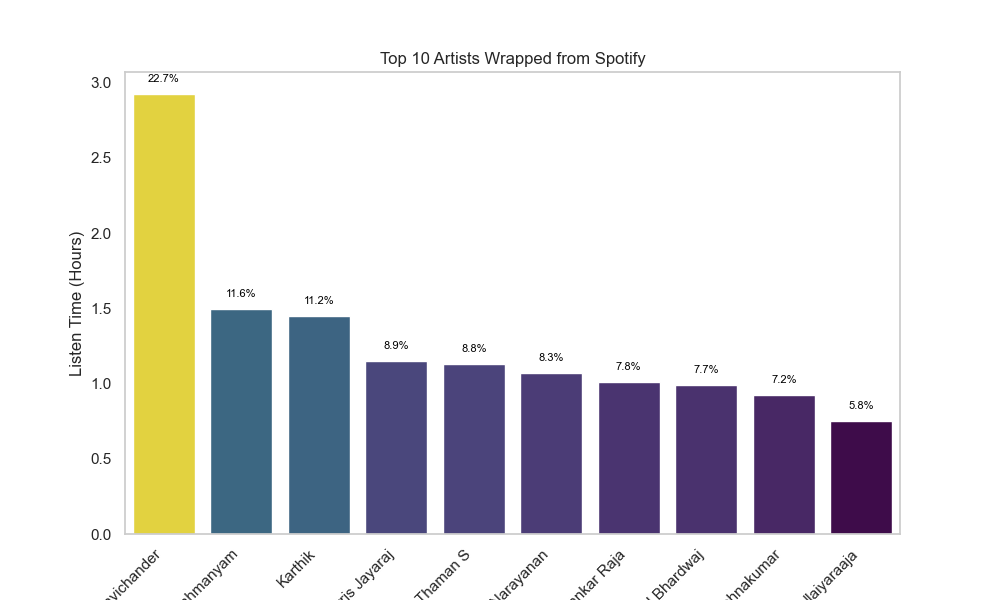
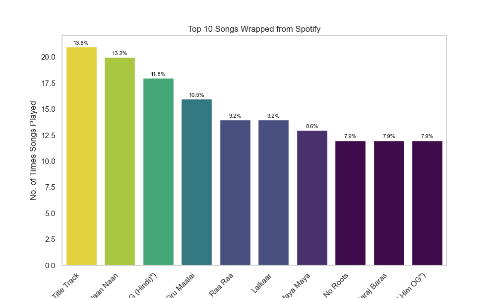
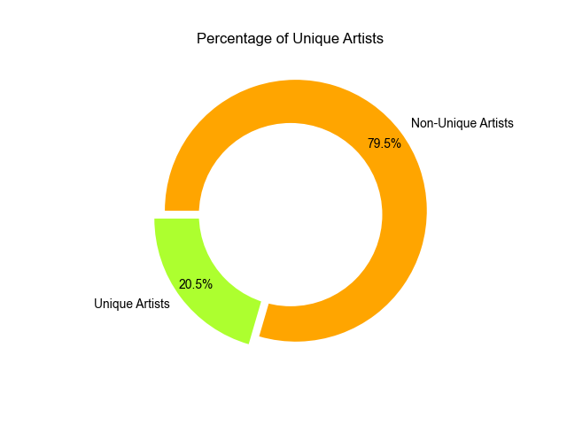

# Spotify Data Analysis Project

## Overview


Welcome to the Spotify Data Analysis project! This project is designed to help you analyze your Spotify listening habits and identify the top 10 artists and songs you've listened to per hour. The analysis is presented through Jupyter Notebooks and visualizations using popular Python libraries such as Numpy, Pandas, Matplotlib, and Seaborn.

## Getting Started

To get started, follow the steps below to obtain your Spotify user data:

1. Open your Spotify application.
2. Navigate to your **Profile**.
3. Click on **Account**.
4. In the account settings, find the **Privacy settings** section.
5. Scroll down to the **Download your data** option and click on **Request Data**.

Spotify will then provide you with a downloadable archive containing your user data, including the required streaming history for this analysis.

## Project Structure

The project follows a specific file structure to organize and present the analysis:

```
SpotifyDA
	|--> AccountData
	|
	|--> README.md
	|
	|--> SpotifyStreamData.csv
	|
	|--> top10artists.ipynb
	|
	|--> top10_artists.png
	|
	|--> top10_songs.png
	|
	|--> unique_artists.png
```

- **AccountData:** This directory is meant to store the Spotify user data downloaded from your account.
- **README.md:** You are currently reading the project's README document.
- **SpotifyStreamData.csv:** This CSV file contains the streaming history extracted from your Spotify data.
- **top10artists.ipynb:** Jupyter Notebook containing the Python code for analyzing and visualizing the top 10 artists and songs.
- **top10_artists.png:** Visualization of the top 10 artists listened to per hour.
- **top10_songs.png:** Visualization of the top 10 songs listened to per hour.
- **unique_artists.png:** Visualization of the unique artists listened to.

## Instructions for Running the Analysis

1. Ensure you have Python installed on your machine.
2. Install the required libraries by running the following command in your terminal:

   ```
   pip install numpy pandas matplotlib seaborn
   ```

3. Open the `top10artists.ipynb` notebook using Jupyter Notebook or any compatible environment.
4. Update the file path in the notebook to point to the location of your `SpotifyStreamData.csv` file.
5. Run the notebook cell by cell to perform the analysis and generate visualizations.

## Results

After running the analysis, the following visualizations are generated:

### Top 10 Artists Listened to per Hour



### Top 10 Songs Listened to per Hour



### %age of Unique Artists Listened



**Note:** The visualizations are done on the data user provided here, so, please download your user data before doing the project.

Feel free to explore, customize, and share your findings based on the insights gained from the analysis!

Enjoy exploring your Spotify data! 🎶

## License

This project is licensed under the MIT License - see the [LICENSE](LICENSE) file for details.
